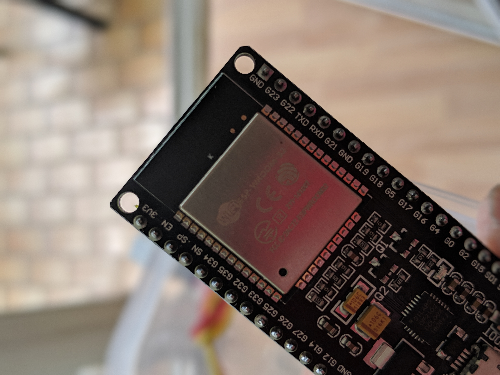
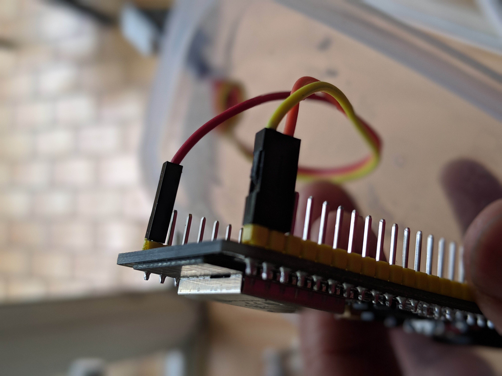

# IoT Room humidity control using ESP32, DHT22 and Adafruit IO

## Introduction
After learning about how to connect Raspberry Pi and ESP32 via MQTT, I stumbled upon another very interesting Github user @DaveSprague who connected the ESP8266 directly to Adafruit IO. This is interesting as it frees my Raspberry Pi for other interesting projects. So I decided this is the way to go. 

## Problem statement
At this point of time it will be worth noting the "real" purpose of this project. I live in Germany where the weather is brutally dry for an Indian like me. My daughter has dry skin problems which got me thinking to start monitorinng the humidity in our house. I found that at times, the humidity can reach well below 30%. According to a quick google research, the average indoor humidity, comfortable for humans, should be between 30%-60%. This is not good and I decided to buy a humidifier for her room. 

The problem with humidifier is that we cant monitor how much is the humidity and or the impact of humidifier after its switched on. 
For this I decided to build this very simple project. 

## Changes to the original code
I took 99% of things from the orignal code from Dave. However, I tweaked it a bit to be used for ESP32 instead of ESP8266 and DHT22 instead of DHT11. I also changed the pin to the pin I am using on the ESP32. Also, I didnt want to exhaust the free usage from Adafruit IO. To do that, I reduced the data collection from 5 second to every 10minutes. You may want to change it based on your individual use case.

## Disclaimer
The code is taken directly from @DaveSprague with very few modification. So a special thanks for Dave for providingn the code and explanation on his Github page: 
https://github.com/openhomeautomation/adafruit-io-esp8266/blob/master/esp8266_sensor_module/esp8266_sensor_module.ino

## Pictures from the project
### The hardware used:

### ESP32 Front

### ESP32 Back connections

### DHT22 connection

### Snug in a box

### Room setup

## Issues faced during the project
### Using Adruino IDE on Raspberry Pi
Getting the ESP32 library installed has been a pain for me with the dreadful "Tool xtensa-esp32-elf-gcc is not available for your operating system". This is now documented as an issue on https://github.com/espressif/arduino-esp32/issues/2651. After some frustration, I just chucked raspberry pi and used a windows machine, installed Arduino IDE there and the code worked as a breeze. 

### IOT Platform
I tried my hand on MQTT using Rotoron's code (mentioned below). But I found it difficult to understand how to bring the data to an IOT cloud from where I could create event and further take action based on that. I put the entire blame on myself and my lack of programming skills. :) Dave's github gives a very clear explanation on how to use Adafruit IO which I found very easy to use. 

### Erroneous values from DHT22
This is also a known fact that DHT22 sometimes can give wrong values. I would get 6 figure values for both Temp and Humidity. I can of course put a condition to ignore any value more than 100% (impossible to get rain within the room). I am too lazy to do that and of course with a 10mins data entry, I am ok to get this one time erroneous value which will get corrected in the next 10mins

### Loose female jumper wires connection on the DHT22
With my many re-configurations, the female jumper wire had become loose and this also contributed to erroneous values from the sensor. I researched on how to tighten the female jumper wires and found this youtube video quite useful https://www.youtube.com/watch?v=-InoAbkNVdQ. This sorted the bad connection issue. Also to ensure this does not happen again, I put the whole circuitry securely in a box. 

### Wrong pin connections
Fortunately, I didn't burn things down, but plugging the wrong pins ended up with my ESP32 and DHT22 being really really hot!!! Lesson learned, please plug things correctly and check it before leaving it unattended.  

--------------------------------------------------------
-------------------OLD----------------------------------
This Repo is for my project to learn about MQTT protocol, use Raspberry Pi and ESP32 chip to transmit, wirelessly, humidity and temp sensor from DHT22.

The end game is to control my humidifier based on humidity values, for which I am currently thinking of using IFTT and a smart electric plug to which the humidifier will be connected.

The project is heavily influenced by the steps shared by rotoron in his website: 
https://www.rototron.info/raspberry-pi-esp32-micropython-tutorial/ 
-------------------------------------------------------
